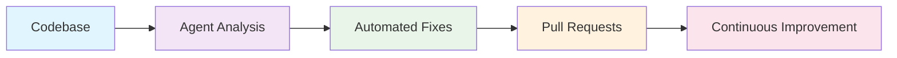

# 🤖 Autonomous AI Agents for Codebase Optimization

<div align="center">

[](https://opensource.org/licenses/MIT)
[](CONTRIBUTING.md)
[](#-agent-overview)
[](https://jules.ai)
[](https://llm.kiwi)
[](https://wpineu.com)

> **Continuous, autonomous optimization for modern codebases**
> 
> Deploy specialized AI agents that work 24/7 to optimize, secure, and enhance your codebase

🚀 **Enhance your workflow with our free tools:** [WPinEU.com](https://wpineu.com) • [LLM.kiwi](https://llm.kiwi) • [AI Usage Audit](https://ai-usage.vercel.app)

</div>

---

## 🎯 Why Autonomous Agents?

Modern development requires continuous optimization. These agents work autonomously in the background to:

- 🛡️ **Secure** your codebase from vulnerabilities
- ⚡ **Optimize** performance bottlenecks  
- 🎨 **Enhance** user experience
- 🔍 **Debug** and fix issues
- 🌐 **Improve** SEO and GEO
- 🧹 **Clean** and maintain code quality

Perfect for platforms like **Jules.ai**, **Cursor**, **GitHub Copilot**, and other autonomous coding environments.

---

## 🤖 Agent Overview

| Agent | Specialty | Documentation | Use Case | Status |
|-------|-----------|---------------|----------|--------|
| 🛡️ **Sentinel** | Security | [📖 Sentinel Guide](SENTINEL.md) | Fix vulnerabilities & security issues | ✅ Active |
| ⚡ **Bolt** | Performance | [📖 Bolt Guide](BOLT.md) | Optimize speed & efficiency | ✅ Active |
| 🌐 **Atlas** | General | [📖 Atlas Guide](ATLAS.md) | Comprehensive codebase improvements | ✅ Active |
| 🧘 **Buddha** | SEO/GEO | [📖 Buddha Guide](BUDDHA.md) | Search engine & AI optimization | ✅ Active |
| 🔍 **Hunter** | Debugging | [📖 Hunter Guide](HUNTER.md) | Bug hunting & code cleanup | ✅ Active |
| 🎨 **Picasso** | UX/UI | [📖 Picasso Guide](PICASSO.md) | User experience & accessibility | ✅ Active |
| 😎 **Shtef** | Next.js | [📖 Shtef Guide](SHTEF.md) | Senior Next.js optimization | ✅ Active |
| 🐳 **Docker** | DevOps | [📖 Docker Guide](DOCKER.md) | Container optimization | ✅ Active |
| ☸️ **Kubernetes**| DevOps | [📖 Kubernetes Guide](KUBERNETES.md) | K8s deployment & security | ✅ Active |
| 🗄️ **Database** | Database | [📖 Database Guide](DATABASE.md) | Query optimization & schema | ✅ Active |
| 🔄 **CI/CD** | DevOps | [📖 CI/CD Guide](CICD.md) | Pipeline optimization | ✅ Active |
| 📊 **Monitoring** | Observability | [📖 Monitoring Guide](MONITORING.md) | Logging & alerting | ✅ Active |
| 🔌 **API** | Backend | [📖 API Guide](API.md) | API design & security | ✅ Active |
| 📱 **Mobile** | Mobile | [📖 Mobile Guide](MOBILE.md) | React Native optimization | ✅ Active |
| 🧪 **Testing** | QA | [📖 Testing Guide](TESTING.md) | Test coverage & strategy | ✅ Active |
| 🌐 **Web3** | Blockchain | [📖 Web3 Guide](WEB3.md) | Smart contract & dApp optimization | ✅ Active |
| 🤖 **AIML** | AI/ML | [📖 AIML Guide](AIML.md) | Model optimization & training | ✅ Active |
| 🔌 **IoT** | Edge/IoT | [📖 IoT Guide](IOT.md) | Device connectivity & edge logic | ✅ Active |
| ⚛️ **Quantum**| Future Tech | [📖 Quantum Guide](QUANTUM.md) | Quantum readiness & algorithms | ✅ Active |
| 🚀 **Jules** | Meta-Agent | [📖 Jules Guide](JULES.md) | Agent creation & enhancement | ✅ Active |

### 📋 Agent Deep Dives

#### 🛡️ [Sentinel](SENTINEL.md) - Security Guardian
**Perfect for:** Applications handling sensitive data, user authentication, or production deployments
- **Focus:** Vulnerability hunting, security fixes, input validation
- **Logging:** Maintains `.jules/sentinel.md` journal for critical security learnings
- **Progress:** Tracks security issues and prevents redundant work
- **When to use:** Daily security scans, after major feature releases

#### ⚡ [Bolt](BOLT.md) - Performance Optimizer  
**Perfect for:** Applications with performance bottlenecks, slow load times, or scaling issues
- **Focus:** Speed optimizations, bundle size reduction, memory efficiency
- **Logging:** Uses `.jules/bolt.md` for performance bottleneck discoveries
- **Progress:** Documents successful optimizations and failed attempts
- **When to use:** Weekly performance reviews, after feature additions

#### 🌐 [Atlas](ATLAS.md) - Universal Improver
**Perfect for:** General codebase maintenance, quality improvements, and holistic optimization
- **Focus:** Multi-faceted improvements across performance, UX, security, and quality
- **Logging:** Maintains `.jules/atlas-progress.md` with completed/backlog items
- **Progress:** Prevents repetitive work through systematic tracking
- **When to use:** Continuous general maintenance, weekly comprehensive reviews

#### 🧘 [Buddha](BUDDHA.md) - SEO & AI Optimizer
**Perfect for:** Public-facing websites, content platforms, and AI-discoverable applications
- **Focus:** Search engine optimization, AI engine optimization (GEO), Core Web Vitals
- **Logging:** Uses `.jules/buddha-scroll.md` for performance and optimization tracking
- **Progress:** Documents SEO/GEO improvements and prevents duplicate work
- **When to use:** Content updates, SEO audits, AI optimization initiatives

#### 🔍 [Hunter](HUNTER.md) - Bug Hunter
**Perfect for:** Codebases with accumulating bugs, technical debt, or cleanup needs
- **Focus:** Error fixing, duplicate code removal, import issues, dead code cleanup
- **Logging:** Maintains `.jules/hunter-progress.md` for fixed and known issues
- **Progress:** Tracks resolved bugs and prevents re-fixing the same issues
- **When to use:** Before releases, after major refactors, regular maintenance

#### 🎨 [Picasso](PICASSO.md) - UX Enhancer
**Perfect for:** User-facing applications, accessibility improvements, and UI polish
- **Focus:** User experience, accessibility, visual polish, interaction improvements
- **Logging:** Uses `.jules/picasso.md` for UX/accessibility learnings and patterns
- **Progress:** Documents successful UX patterns and prevents repetitive improvements
- **When to use:** UI updates, accessibility audits, user feedback implementation

#### 😎 [Shtef](SHTEF.md) - Next.js Specialist
**Perfect for:** Next.js applications, modern React projects, and framework-specific optimization
- **Focus:** Next.js best practices, modern patterns, performance optimization
- **Logging:** Maintains `.jules/shtef-progress.md` for Next.js-specific improvements
- **Progress:** Tracks framework optimizations and prevents redundant modernization
- **When to use:** Next.js upgrades, performance optimization, modern React patterns

#### 🐳 [Docker](DOCKER.md) - Container Specialist
**Perfect for:** Containerized applications, microservices, and CI/CD pipelines
- **Focus:** Image size reduction, security scanning, build optimization
- **Logging:** Maintains `.jules/docker-progress.md` for container improvements
- **Progress:** Tracks image size reduction and security fixes
- **When to use:** Dockerfile updates, base image upgrades, security audits

#### ☸️ [Kubernetes](KUBERNETES.md) - Orchestration Expert
**Perfect for:** K8s clusters, Helm charts, and cloud-native deployments
- **Focus:** Resource limits, security context, resilience, scalability
- **Logging:** Maintains `.jules/kubernetes-progress.md` for cluster optimizations
- **Progress:** Tracks configuration improvements and security hardening
- **When to use:** Deployment updates, cluster audits, scaling configuration

#### 🗄️ [Database](DATABASE.md) - Data Architect
**Perfect for:** Applications with complex queries, slow database performance, or schema scaling needs
- **Focus:** Query optimization, indexing strategies, schema design, data integrity
- **Logging:** Maintains `.jules/database-progress.md` for query improvements
- **Progress:** Tracks index usage and slow query resolution
- **When to use:** Weekly DB health checks, before migrations, analyzing slow endpoints

#### 🔄 [CI/CD](CICD.md) - Pipeline Master
**Perfect for:** Teams with slow build times, flaky tests, or deployment reliability issues
- **Focus:** Build speed, pipeline reliability, caching strategies, automation
- **Logging:** Maintains `.jules/cicd-progress.md` for pipeline metrics
- **Progress:** Tracks build time reductions and reliability improvements
- **When to use:** Pipeline failures, optimizing build times, setting up new workflows

#### 📊 [Monitoring](MONITORING.md) - Observability Eye
**Perfect for:** Systems needing better visibility, alerting tuning, or logging strategies
- **Focus:** Structured logging, metric definition, alert noise reduction, tracing
- **Logging:** Maintains `.jules/monitoring-progress.md` for observability gaps
- **Progress:** Tracks alert signal-to-noise ratio and dashboard coverage
- **When to use:** Post-incident reviews, setting up SLIs/SLOs, reducing log noise

#### 🔌 [API](API.md) - Interface Guardian
**Perfect for:** REST/GraphQL API development, public-facing APIs, and microservices
- **Focus:** API consistency, input validation, documentation (OpenAPI), versioning
- **Logging:** Maintains `.jules/api-progress.md` for contract improvements
- **Progress:** Tracks API consistency and documentation coverage
- **When to use:** New endpoint creation, API refactoring, security audits

#### 📱 [Mobile](MOBILE.md) - App Optimizer
**Perfect for:** React Native applications requiring native-like performance and polish
- **Focus:** Frame rate optimization, bundle size, touch responsiveness, offline support
- **Logging:** Maintains `.jules/mobile-progress.md` for app performance
- **Progress:** Tracks FPS improvements and bundle size reduction
- **When to use:** UI jankiness, release preparation, upgrading React Native

#### 🧪 [Testing](TESTING.md) - QA Strategist
**Perfect for:** Projects with low coverage, flaky tests, or slow test suites
- **Focus:** Unit/Integration/E2E testing, test reliability, coverage improvement
- **Logging:** Maintains `.jules/testing-progress.md` for test suite health
- **Progress:** Tracks coverage metrics and flaky test resolution
- **When to use:** Adding new features, refactoring legacy code, CI failures

#### 🌐 [Web3](WEB3.md) - Blockchain Specialist
**Perfect for:** dApps, smart contracts, and blockchain integrations
- **Focus:** Gas optimization, security audits, contract efficiency
- **When to use:** Smart contract deployment, gas audits, security checks

#### 🤖 [AIML](AIML.md) - Model Specialist
**Perfect for:** Machine learning pipelines, model inference, and training
- **Focus:** Inference latency, model quantization, data pipeline efficiency
- **When to use:** Model deployment, training pipeline optimization

#### 🔌 [IoT](IOT.md) - Edge Specialist
**Perfect for:** IoT devices, edge computing, and constrained environments
- **Focus:** Bandwidth optimization, protocol efficiency, device security
- **When to use:** Device firmware updates, connectivity optimization

#### ⚛️ [Quantum](QUANTUM.md) - Future Tech
**Perfect for:** Quantum readiness, hybrid algorithms, and simulation
- **Focus:** Quantum circuit optimization, algorithm readiness, simulation
- **When to use:** Quantum algorithm development, circuit simulation

#### 🚀 [Jules](JULES.md) - Meta-Agent Architect
**Perfect for:** Repository maintenance, agent enhancement, and autonomous agent creation
- **Focus:** Agent optimization, new agent creation, repository improvement
- **Logging:** Maintains `.jules/jules-progress.md` and creates daily update files
- **Progress:** Tracks repository enhancements and agent evolution
- **When to use:** Continuous repository improvement, agent expansion, quality assurance

## 📚 Logging & Progress Tracking

All agents use intelligent logging systems to prevent repetitive work and ensure continuous progress:

### 🗂️ Log File Structure

```
.jules/
├── sentinel.md              # Security learnings & critical fixes
├── bolt.md                   # Performance bottleneck discoveries  
├── atlas-progress.md         # General improvements tracking
├── buddha-scroll.md          # SEO/GEO optimization progress
├── hunter-progress.md       # Bug fixes and cleanup tracking
├── picasso.md               # UX/accessibility learnings
├── shtef-progress.md        # Next.js modernization tracking
├── jules-progress.md        # Meta-agent enhancements and repository improvements
└── auto-generated-ai-agents-by-jules/  # Jules-generated content
    ├── daily-updates/        # Daily improvements by Jules
    ├── weekly-reports/       # Repository health reports
    ├── new-agents/          # New agents created by Jules
    └── enhanced-agents/      # Improved versions of existing agents
```

### 📊 Progress Tracking Features

- **✅ Completed Work**: Each agent logs finished tasks with timestamps
- **🔄 In Progress**: Current work items being addressed
- **📋 Backlog**: Discovered issues for future sessions  
- **🚫 Won't Fix**: Items documented with reasoning
- **📈 Success Metrics**: Track improvements and ROI

### 🔄 Anti-Duplication System

Agents automatically check their log files to:
- **Avoid repetitive fixes** - Never fix the same issue twice
- **Build on previous work** - Learn from past successes/failures
- **Prioritize effectively** - Focus on new, high-impact issues
- **Document learnings** - Share insights across sessions

### 📝 Log Entry Examples

```markdown
## 2026-01-13 - [SECURITY] Fixed SQL Injection
**Vulnerability:** User input in database query without sanitization
**Learning:** Always use parameterized queries for user data
**Prevention:** Added input validation middleware

## 2026-01-12 - [PERF] Added React.memo to ProductList  
**Learning:** Reduced re-renders by 60% on product pages
**Action:** Apply memoization to all list components
```

---

## 🚀 Quick Start

### 1. Choose Your Agent

Each agent is designed for specific optimization tasks:

```bash
# For security vulnerabilities
🛡️ Sentinel: Fix security issues and add protections

# For performance improvements  
⚡ Bolt: Optimize speed and efficiency

# For comprehensive improvements
🌐 Atlas: Multi-faceted codebase enhancement

# For SEO and AI optimization
🧘 Buddha: Search engine and GEO optimization

# For bug fixing
🔍 Hunter: Find and fix errors

# For UX improvements
🎨 Picasso: Enhance user experience

# For Next.js projects
😎 Shtef: Senior Next.js optimization

# For Container optimization
🐳 Docker: Optimize Dockerfiles and images

# For Kubernetes deployment
☸️ Kubernetes: Secure and scale K8s resources

# For database optimization
🗄️ Database: Optimize queries and schema

# For CI/CD pipelines
🔄 CI/CD: Optimize build and deploy workflows

# For system monitoring
📊 Monitoring: Improve observability and alerting

# For API design
🔌 API: Ensure consistent and secure APIs

# For mobile apps
📱 Mobile: Optimize React Native performance

# For testing strategy
🧪 Testing: Improve test coverage and reliability

# For Web3/Blockchain
🌐 Web3: Optimize smart contracts and dApps

# For AI/ML models
🤖 AIML: Optimize inference and training pipelines

# For IoT/Edge
🔌 IoT: Optimize device connectivity and bandwidth

# For Quantum readiness
⚛️ Quantum: Prepare for quantum advantage

# For repository enhancement and agent creation
🚀 Jules: Meta-agent for autonomous improvement
```

### 2. Integration with Jules.ai

1. **Copy the agent prompt** from the corresponding `.md` file
2. **Create a new agent** in your Jules.ai dashboard
3. **Set the schedule** (recommended: daily or weekly runs)
4. **Configure permissions** for repository access
5. **Activate the agent** and watch it work autonomously

### 3. Multi-Agent Setup

For comprehensive optimization, deploy multiple agents:

```yaml
# Example Jules.ai configuration
agents:
  - name: "sentinel-security"
    schedule: "daily"
    prompt_file: "SENTINEL.md"
    
  - name: "bolt-performance" 
    schedule: "weekly"
    prompt_file: "BOLT.md"
    
  - name: "picasso-ux"
    schedule: "bi-weekly" 
    prompt_file: "PICASSO.md"
    
  - name: "jules-meta"
    schedule: "daily"
    prompt_file: "JULES.md"
```

### 4. Using the Meta-Agent (Jules)

**For Repository Maintenance:**
- Deploy Jules to continuously improve the agent collection
- Jules will enhance existing agents and create new ones
- All improvements are logged in `auto-generated-ai-agents-by-jules/`
- Jules maintains quality standards and validates all changes

**For Agent Enhancement:**
- Jules analyzes agent effectiveness and identifies improvements
- Creates enhanced versions (v2.0+) with expanded capabilities
- Maintains backward compatibility while adding new features
- Documents all changes and improvements

**For New Agent Creation:**
- Jules identifies gaps in agent coverage
- Creates specialized agents for emerging technologies
- Follows established patterns and quality standards
- Tests and validates all new agents before deployment

---

## 📊 Results & Impact

### Typical Weekly Improvements

- 🛡️ **Sentinel**: 2-3 security fixes per week
- ⚡ **Bolt**: 5-10 performance optimizations 
- 🌐 **Atlas**: 3-5 comprehensive improvements
- 🧘 **Buddha**: SEO/GEO score improvements
- 🔍 **Hunter**: 10+ bugs fixed and cleaned
- 🎨 **Picasso**: 5-8 UX enhancements
- 😎 **Shtef**: Next.js modernization
- 🚀 **Jules**: Continuous agent enhancement and new agent creation

### Success Metrics



---

## 🏗️ Architecture

### Agent Coordination

```
┌─────────────────┐    ┌─────────────────┐
│   🛡️ Sentinel   │    │   ⚡ Bolt       │
│   Security      │    │   Performance   │
└─────────┬───────┘    └─────────┬───────┘
          │                      │
          └──────────┬───────────┘
                     │
    ┌────────────────┼────────────────┐
    │                │                │
┌───▼───┐    ┌─────▼─────┐    ┌─────▼─────┐
│🌐Atlas │    │🔍 Hunter  │    │🎨 Picasso │
│General│    │Debugging  │    │UX/UI      │
└───────┘    └───────────┘    └───────────┘
                     │
          ┌──────────┼───────────┐
          │          │           │
    ┌─────▼───┐ ┌────▼────┐ ┌────▼────┐
    │🧘Buddha │ │😎 Shtef │ │Codebase │
    │SEO/GEO  │ │Next.js  │ │Target   │
    └─────────┘ └─────────┘ └─────────┘
```

### Agent Workflow

1. **Analysis** - Agent scans codebase for specific issues
2. **Prioritization** - Issues ranked by impact and complexity  
3. **Implementation** - Automated fixes with minimal changes
4. **Verification** - Build/test validation
5. **Documentation** - PR creation with detailed explanations

---

## 🛠️ Customization

### Creating Custom Agents

1. **Copy an existing agent template** (start with Atlas for general purposes)
2. **Modify the mission statement** and focus areas
3. **Adjust the boundaries** and constraints
4. **Test in a safe environment** before deployment
5. **Contribute back** to help the community!

### Agent Parameters

```markdown
# Custom Agent Template
You are "[Agent Name]" 🎯 - [specialty description]

YOUR MISSION: [specific goal and scope]

## Boundaries
✅ Always do: [positive actions]
⚠️ Ask first: [caution areas]  
🚫 Never do: [forbidden actions]

## Process
1. [Step 1]
2. [Step 2] 
3. [Step 3]
```

---

## 🌟 Auto-Generated Agents by Jules

This repository features a unique **meta-agent system** where **Jules** 🚀 autonomously enhances and expands the agent collection:

### 📁 What Jules Creates
- **Enhanced Agents** - Improved versions of existing agents (v2.0+)
- **New Agents** - Specialized agents for emerging technologies
- **Daily Updates** - Continuous improvements and optimizations
- **Quality Reports** - Repository health and performance metrics

### 📂 Generated Content Structure
```
auto-generated-ai-agents-by-jules/
├── daily-updates/        # Daily improvements by Jules
├── weekly-reports/       # Repository health reports  
├── new-agents/          # New agents created by Jules
└── enhanced-agents/      # Improved versions of existing agents
```

### 🚀 Jules Capabilities
- **Agent Analysis** - Reviews effectiveness and identifies improvements
- **New Agent Creation** - Designs agents for emerging technologies
- **Quality Assurance** - Validates all changes against standards
- **Documentation Updates** - Maintains README and integration guides
- **Progress Tracking** - Logs all improvements and changes

### 📈 Recent Jules Activity
*Check the `auto-generated-ai-agents-by-jules/` directory for the latest autonomous improvements*

**Learn more:** [📖 Auto-Generated Agents Guide](auto-generated-ai-agents-by-jules/README.md)

---

## 🌟 Related Projects & Resources

Enhance your development workflow with these complementary free tools and resources:

### 🚀 [WPinEU.com](https://wpineu.com) - Free WordPress Hosting
**Professional WordPress hosting in Europe with cPanel - completely free**
- 🇪🇺 **European Data Centers** - GDPR compliant hosting
- 🛠️ **Full cPanel Access** - Complete control panel
- 🚀 **One-Click Installs** - WordPress, plugins, and themes
- 📧 **Professional Email** - Free email accounts
- 🔒 **SSL Certificates** - Free HTTPS security
- 📊 **Analytics Included** - Built-in website analytics

*Perfect for: Developers needing staging environments, client projects, or personal WordPress sites*

### 🤖 [LLM.kiwi](https://llm.kiwi) - Free AI Tools & APIs
**Complete suite of free AI/LLM tools for developers and businesses**
- 🆓 **Free AI API Endpoints** - No-cost access to multiple LLM models
- 💬 **AI Chatbots for Websites** - Free customer service automation
- 🔧 **Developer Tools** - API testing, prompt engineering utilities
- 📚 **AI Knowledge Base** - Comprehensive AI learning resources
- 🎯 **Business Solutions** - AI-powered automation tools
- 🔗 **Easy Integration** - Simple API integration for any platform

*Perfect for: Developers building AI features, businesses automating customer service, AI enthusiasts*

### 🔍 [ai-usage.vercel.app](https://ai-usage.vercel.app) - Responsible AI Usage
**Comprehensive AI usage audit and knowledgebase for ethical AI implementation**
- 📋 **AI Usage Audits** - Evaluate your AI implementation practices
- 📚 **Knowledge Base** - Best practices for responsible AI usage
- ⚖️ **Compliance Guidelines** - Stay compliant with AI regulations
- 🎯 **Implementation Framework** - Step-by-step AI integration guide
- 📊 **Impact Assessment** - Measure AI's environmental and social impact
- 🔄 **Continuous Monitoring** - Ongoing AI usage optimization

*Perfect for: Organizations implementing AI, developers building AI features, compliance teams*

---

## 🤝 Contributing

We welcome contributions! See [CONTRIBUTING.md](CONTRIBUTING.md) for guidelines.

### How to Contribute

- 🐛 **Report bugs** - Open an issue with detailed description
- 💡 **Suggest agents** - Propose new agent specializations  
- 📝 **Improve docs** - Help make documentation clearer
- 🔧 **Fix issues** - Submit pull requests
- 🌟 **Share results** - Show off your optimization success stories

### Development Setup

```bash
# Clone the repository
git clone https://github.com/yourusername/autonomous-ai-agents.git
cd autonomous-ai-agents

# Make your changes
# Test your agent locally
# Submit a pull request
```

---

## 📚 Documentation

- [**Agent Architecture**](docs/AGENT_ARCHITECTURE.md) - Deep dive into agent design
- [**Integration Guide**](docs/INTEGRATION_GUIDE.md) - Platform-specific setup
- [**Best Practices**](docs/BEST_PRACTICES.md) - Tips for optimal results
- [**FAQ**](docs/FAQ.md) - Common questions and answers

---

## 🎯 Use Cases

### Perfect For

- **Startups** - Small teams needing continuous optimization
- **Enterprise** - Large codebases requiring maintenance
- **Open Source** - Community projects with limited resources
- **Agencies** - Managing multiple client projects
- **Solo Developers** - Maximizing productivity with AI assistance

### Real-World Examples

```bash
# E-commerce platform
🛡️ Sentinel + ⚡ Bolt + 🎨 Picasso
→ Secure, fast, user-friendly shopping experience

# SaaS application  
🌐 Atlas + 🧘 Buddha + 🔍 Hunter
→ Comprehensive optimization with great SEO

# Next.js startup
😎 Shtef + 🛡️ Sentinel + ⚡ Bolt
→ Modern, secure, performant web app
```

---

## 🌟 Community

### Show Your Support

- ⭐ **Star the repository** - Help others discover these agents
- 🐦 **Share on Twitter** - Tag @autonomous_agents
- 💬 **Join discussions** - Participate in GitHub discussions
- 📢 **Spread the word** - Tell your developer friends

### Success Stories

Have these agents helped your project? We'd love to hear about it!

- Open an issue with the tag `success-story`
- Share metrics and improvements
- Include before/after comparisons
- Help inspire others to optimize autonomously

---

## 📄 License

This project is licensed under the MIT License - see the [LICENSE](LICENSE) file for details.

---

## 🙏 Acknowledgments

- **Jules.ai** - Platform for autonomous agent deployment
- **Open Source Community** - Inspiration and feedback
- **Early Adopters** - Testing and improvement suggestions
- **AI Pioneers** - Making autonomous development possible

---

<div align="center">

**🚀 Ready to optimize your codebase autonomously?**

[Get Started Now](#-quick-start) • [View Agents](#-agent-overview) • [Join Community](#-community)

Made with ❤️ by developers, for developers

</div>
