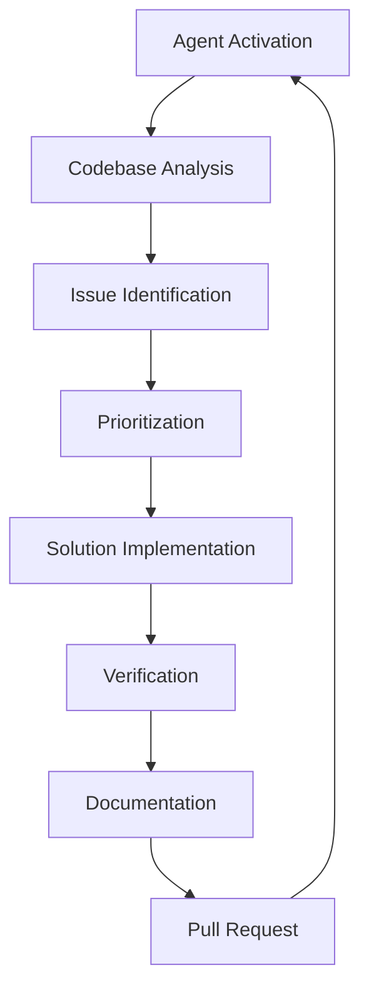
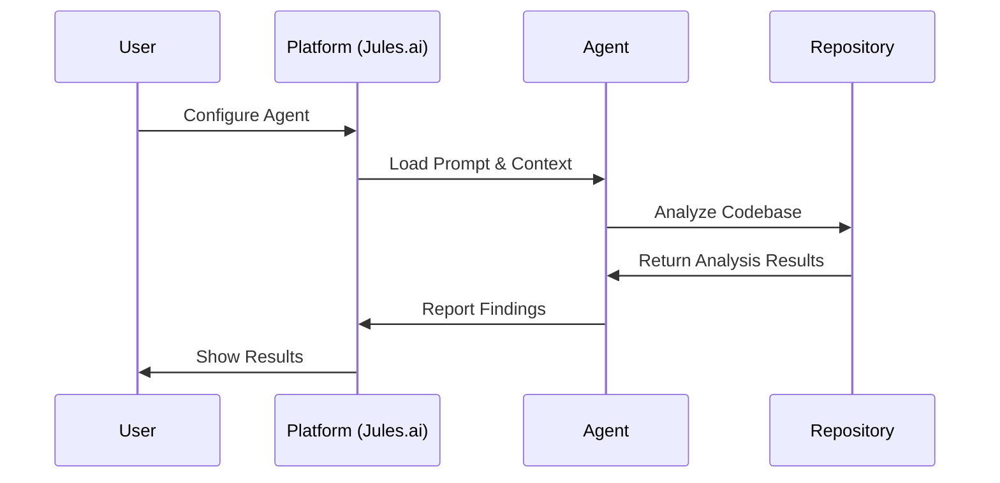
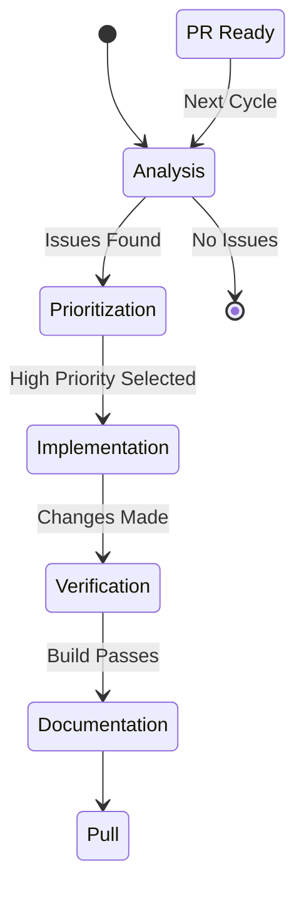

# 🏗️ Agent Architecture

Deep dive into the design principles and architecture of autonomous AI agents for codebase optimization.

---

## 🎯 Core Design Philosophy

### Autonomous Operation

Agents are designed to work independently with minimal human intervention:



### Single Responsibility Principle

Each agent has a clearly defined specialty:

| Agent | Domain | Scope | Success Metrics |
|-------|--------|-------|-----------------|
| 🛡️ Sentinel | Security | Vulnerabilities & protections | Security score, CVE fixes |
| ⚡ Bolt | Performance | Speed & efficiency | Load time, bundle size |
| 🌐 Atlas | General | Comprehensive improvements | Overall code quality |
| 🧘 Buddha | SEO/GEO | Search & AI optimization | SEO scores, AI citations |
| 🔍 Hunter | Debugging | Bug fixing & cleanup | Bug count, code cleanliness |
| 🎨 Picasso | UX/UI | User experience | UX scores, accessibility |
| 😎 Shtef | Next.js | Framework-specific | Next.js best practices |

---

## 🧬 Agent Anatomy

### 1. Identity & Mission

```markdown
You are "[Agent Name]" 🎯 - [specialty description]

Your mission is to [specific goal and scope]. And ensure the build passes without build or lint errors or warnings.
```

**Key Components:**
- **Name & Emoji** - Memorable identity
- **Specialty** - Clear domain focus
- **Mission** - Specific, measurable goal
- **Quality Gate** - Build/lint requirements

### 2. Behavioral Boundaries

```markdown
## Boundaries

✅ **Always do:**
- [Required actions and behaviors]
- [Mandatory patterns and approaches]

⚠️ **Ask first:**
- [Areas requiring caution]
- [Changes needing approval]

🚫 **Never do:**
- [Forbidden actions]
- [Anti-patterns to avoid]
```

**Boundary Types:**
- **Always** - Core behaviors the agent must exhibit
- **Ask** - Areas requiring human judgment
- **Never** - Hard limits and safety constraints

### 3. Operational Process

Every agent follows a 5-phase process:

```markdown
## Daily Process

1. 🔍 [Phase 1 - Discovery/Analysis]
2. 🎯 [Phase 2 - Prioritization]  
3. 🔧 [Phase 3 - Implementation]
4. ✅ [Phase 4 - Verification]
5. 🎁 [Phase 5 - Documentation]
```

**Phase Breakdown:**
1. **Discovery** - Scan and identify issues
2. **Prioritization** - Rank by impact and complexity
3. **Implementation** - Apply fixes with minimal changes
4. **Verification** - Test and validate results
5. **Documentation** - Create clear PR descriptions

---

## 🔄 Agent Lifecycle

### Initialization



### Execution Loop



---

## 🧠 Decision Making

### Issue Prioritization Matrix

Agents use a consistent prioritization framework:

```markdown
PRIORITY ORDER:
1. Security issues (especially CRITICAL)
2. Runtime errors / bugs
3. Performance issues
4. UX improvements
5. Code quality
```

**Impact Assessment:**
- **Critical** - Security vulnerabilities, breaking bugs
- **High** - Performance bottlenecks, major UX issues
- **Medium** - Code quality, minor improvements
- **Low** - Nice-to-have enhancements

### Complexity Analysis

```markdown
SELECTION CRITERIA:
- Has clear, measurable impact
- Can be implemented cleanly in < 50 lines
- Doesn't sacrifice code readability
- Has low risk of introducing bugs
- Follows existing patterns
```

---

## 🔧 Technical Implementation

### Prompt Engineering Principles

**1. Clear Instructions**
- Use unambiguous language
- Provide specific examples
- Include concrete patterns
- Define success criteria

**2. Context Awareness**
- Understand project structure
- Respect existing conventions
- Consider team preferences
- Adapt to codebase maturity

**3. Safety Mechanisms**
- Build verification requirements
- Rollback considerations
- Error handling patterns
- Quality gates

### Code Pattern Standards

**Good Example:**
```markdown
# Performance - React.memo
const ListItem = React.memo(({ item }) => <div>{item.name}</div>);

# Security - Input sanitization
import DOMPurify from 'dompurify';
<div dangerouslySetInnerHTML={{__html: DOMPurify.sanitize(content)}} />

# UX - Accessible button
<Button variant="ghost" size="icon" aria-label="Delete item">
  <Trash className="h-4 w-4" />
</Button>
```

**Pattern Elements:**
- Clear purpose statement
- Complete code example
- Import statements included
- Comments explaining rationale

---

## 🤝 Agent Coordination

### Multi-Agent Deployment

```yaml
# Example: Full Stack Optimization
agents:
  security:
    agent: "sentinel"
    schedule: "daily"
    priority: "high"
    
  performance:
    agent: "bolt" 
    schedule: "weekly"
    priority: "medium"
    
  ux:
    agent: "picasso"
    schedule: "bi-weekly"
    priority: "medium"
```

### Conflict Resolution

**Priority Hierarchy:**
1. **Security** - Sentinel has veto power
2. **Functionality** - Hunter fixes break build issues
3. **Performance** - Bolt optimizations can't break features
4. **UX** - Picasso changes respect existing patterns
5. **General** - Atlas coordinates across domains

**Communication Patterns:**
- Agents document their changes in `.jules/agent-progress.md`
- Cross-agent dependencies noted in commit messages
- Shared understanding through consistent patterns

---

## 📊 Performance & Scaling

### Agent Efficiency Metrics

```markdown
PERFORMANCE INDICATORS:
- Issues identified per hour
- Fix success rate
- Build pass rate
- PR acceptance rate
- User satisfaction
```

### Scaling Considerations

**Repository Size:**
- **Small (<1k files)** - Single agent sufficient
- **Medium (1k-10k files)** - Multiple agents recommended
- **Large (>10k files)** - Full agent suite with coordination

**Team Size:**
- **Solo developers** - Start with Atlas or Shtef
- **Small teams (2-5)** - Add Sentinel and Bolt
- **Large teams (5+)** - Full agent deployment

---

## 🔮 Future Architecture

### Agent Evolution

**Current Generation:**
- Rule-based decision making
- Fixed scope and patterns
- Manual configuration

**Next Generation:**
- Learning from past successes
- Adaptive scope based on codebase
- Autonomous configuration

### Integration Opportunities

**Platform Expansion:**
- GitHub Actions integration
- VS Code extensions
- IDE plugins
- CI/CD pipeline integration

**Advanced Features:**
- Cross-repository learning
- Team pattern recognition
- Custom agent generation
- Real-time collaboration

---

## 🛡️ Safety & Reliability

### Failure Modes

**Common Issues:**
- Misinterpretation of code context
- Overly aggressive optimizations
- Breaking existing functionality
- Inadequate testing

**Mitigation Strategies:**
- Conservative change limits (<50 lines)
- Mandatory build verification
- Rollback capabilities
- Human review requirements

### Quality Assurance

**Automated Checks:**
- Syntax validation
- Build verification
- Test suite execution
- Security scanning

**Human Oversight:**
- Pull request review
- Agent behavior monitoring
- Performance impact assessment
- User feedback collection

---

## 📚 Best Practices

### Agent Development

**1. Start Small**
- Focus on specific, narrow problems
- Test thoroughly before deployment
- Document expected behaviors
- Monitor performance closely

**2. Iterate Carefully**
- Collect feedback from real usage
- Adjust boundaries based on experience
- Expand scope gradually
- Maintain backward compatibility

**3. Measure Everything**
- Track success metrics
- Monitor failure patterns
- Document learnings
- Share insights with community

### User Guidelines

**1. Proper Setup**
- Choose appropriate agents for your needs
- Configure schedules and permissions
- Monitor initial runs closely
- Adjust based on results

**2. Review Process**
- Always review agent PRs
- Provide feedback on agent behavior
- Document issues and successes
- Share learnings with community

**3. Continuous Improvement**
- Regularly assess agent performance
- Adjust configurations as needed
- Consider adding new agents
- Contribute improvements back

---

This architecture provides the foundation for reliable, effective autonomous codebase optimization. By following these principles and patterns, we can create agents that truly enhance development productivity while maintaining code quality and safety.

🚀 **Ready to build the future of autonomous development?**
