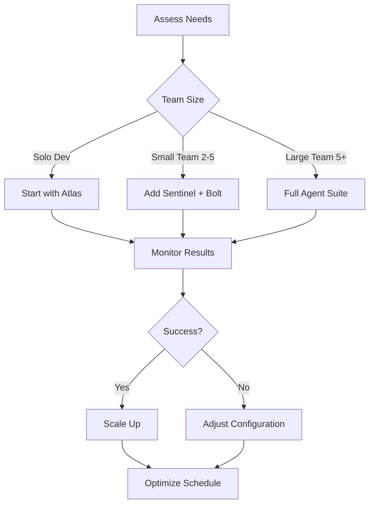

# 📚 Best Practices

Comprehensive guide for getting the most value from autonomous AI agents in your development workflow.

---

## 🎯 Agent Selection Strategy

### Start Small, Scale Smart



### Agent Priority Matrix

| Project Type | Primary Agents | Secondary Agents | Schedule |
|--------------|----------------|------------------|----------|
| **Startup MVP** | 🌐 Atlas, 🛡️ Sentinel | ⚡ Bolt | Daily |
| **E-commerce** | 🛡️ Sentinel, ⚡ Bolt, 🎨 Picasso | 🧘 Buddha | Daily/Weekly |
| **SaaS Platform** | Full Suite | Custom Agents | Continuous |
| **Open Source** | 🔍 Hunter, 🌐 Atlas | 🎨 Picasso | Weekly |
| **Next.js App** | 😎 Shtef, 🛡️ Sentinel | ⚡ Bolt | Daily |

---

## 🚀 Deployment Best Practices

### 1. Configuration Management

```yaml
# .jules/config.yml - Centralized agent configuration
global_settings:
  timezone: "UTC"
  notification_channel: "#dev-alerts"
  approval_required: false
  
agents:
  sentinel:
    enabled: true
    schedule: "0 9 * * *"  # Daily 9 AM
    priority: "high"
    timeout: "30m"
    max_changes_per_run: 5
    
  bolt:
    enabled: true
    schedule: "0 10 * * 1"  # Weekly Monday 10 AM
    priority: "medium"
    timeout: "45m"
    performance_threshold: 90
    
  picasso:
    enabled: false  # Enable after 2 weeks
    schedule: "0 14 * * 3"  # Bi-weekly Wednesday 2 PM
    priority: "low"
    require_approval: true
```

### 2. Gradual Rollout Strategy

```bash
# Phase 1: Test on non-critical repository
echo "🧪 Phase 1: Testing on dev-repo"
jules deploy-agent sentinel --repo dev-repo --dry-run

# Phase 2: Enable with monitoring
echo "📊 Phase 2: Enable with monitoring"
jules deploy-agent sentinel --repo staging-repo --monitor

# Phase 3: Full deployment
echo "🚀 Phase 3: Full deployment"
jules deploy-agent sentinel --repo production-repo --auto-merge
```

### 3. Environment-Specific Configuration

```javascript
// config/environments.js
const environments = {
  development: {
    agents: ['atlas', 'hunter'],
    schedule: 'on_commit',
    auto_merge: true,
    notification_level: 'verbose'
  },
  
  staging: {
    agents: ['sentinel', 'bolt', 'atlas'],
    schedule: 'hourly',
    auto_merge: false,
    notification_level: 'normal'
  },
  
  production: {
    agents: ['sentinel', 'bolt', 'picasso', 'atlas'],
    schedule: 'daily',
    auto_merge: false,
    notification_level: 'critical_only',
    require_approval: ['sentinel', 'bolt']
  }
};
```

---

## 📊 Monitoring & Success Metrics

### Key Performance Indicators

```typescript
// monitoring/metrics.ts
interface AgentMetrics {
  // Effectiveness Metrics
  issuesIdentified: number;
  issuesFixed: number;
  fixSuccessRate: number;
  
  // Efficiency Metrics  
  avgExecutionTime: number;
  prMergeRate: number;
  falsePositiveRate: number;
  
  // Impact Metrics
  codeQualityScore: number;
  securityScore: number;
  performanceScore: number;
  userSatisfaction: number;
}

export class MetricsCollector {
  generateReport(agent: string, timeframe: string): AgentMetrics {
    return {
      issuesIdentified: this.countIssues(agent, timeframe),
      issuesFixed: this.countFixes(agent, timeframe),
      fixSuccessRate: this.calculateSuccessRate(agent, timeframe),
      avgExecutionTime: this.getAvgExecutionTime(agent, timeframe),
      prMergeRate: this.getPRMergeRate(agent, timeframe),
      falsePositiveRate: this.getFalsePositiveRate(agent, timeframe),
      codeQualityScore: this.getCodeQualityScore(),
      securityScore: this.getSecurityScore(),
      performanceScore: this.getPerformanceScore(),
      userSatisfaction: this.getUserSatisfactionScore()
    };
  }
}
```

### Success Dashboard

```markdown
## 📈 Agent Performance Dashboard

### 🛡️ Sentinel - Security Agent
- **Issues Fixed**: 23 this month
- **Success Rate**: 94%
- **Avg Response Time**: 2.3 hours
- **Critical Vulnerabilities**: 0 (down from 3)

### ⚡ Bolt - Performance Agent  
- **Optimizations**: 15 this month
- **Performance Gain**: 18% faster load times
- **Bundle Size**: Reduced by 12%
- **Lighthouse Score**: 92 (up from 78)

### 🎨 Picasso - UX Agent
- **UX Improvements**: 8 this month
- **Accessibility Score**: 95 (WCAG AA)
- **User Feedback**: 4.7/5 stars
- **Conversion Rate**: +3.2%
```

---

## 🔧 Agent Optimization

### Customizing Agent Behavior

```markdown
# Customizing Sentinel for Your Stack
## Additional Security Rules for Your Project

✅ **Always do:**
- Check for API key exposure in .env files
- Validate all user inputs in API routes
- Use parameterized queries for database operations
- Implement rate limiting on authentication endpoints

⚠️ **Ask first:**
- Changes to authentication middleware
- Database schema modifications
- Third-party service integrations

🚫 **Never do:**
- Commit sensitive configuration
- Disable security features for convenience
- Use eval() or similar dangerous functions
- Skip input validation
```

### Performance Tuning

```yaml
# performance/agent-tuning.yml
agent_optimizations:
  sentinel:
    # Focus on high-impact security issues
    issue_filters:
      - severity: "critical"
      - severity: "high"
    max_scan_depth: 5  # Limit scan depth for speed
    cache_results: true
    
  bolt:
    # Prioritize user-facing performance
    focus_areas:
      - "bundle_size"
      - "load_time"
      - "lighthouse_score"
    optimization_targets:
      bundle_size_reduction: "10%"
      load_time_improvement: "5%"
    
  picasso:
    # Focus on accessibility wins
    accessibility_targets:
      wcag_compliance: "AA"
      color_contrast: 4.5
      keyboard_navigation: true
```

---

## 🛡️ Security & Safety

### Agent Security Guidelines

```markdown
## 🔒 Security Best Practices

### 1. Principle of Least Privilege
- Agents only need access to what they require
- Read-only access for analysis agents
- Write access only for PR creation
- No access to production secrets

### 2. Audit Trail
- Log all agent actions
- Track changes made by each agent
- Maintain rollback capability
- Regular security reviews

### 3. Human Oversight
- Critical changes require review
- Security fixes get priority review
- Emergency rollback procedures
- Clear escalation paths
```

### Safe Deployment Checklist

```bash
#!/bin/bash
# scripts/safety-check.sh

echo "🔒 Running safety checks before agent deployment..."

# Check 1: Repository permissions
echo "✅ Checking repository permissions..."
jules check-permissions --repo $TARGET_REPO

# Check 2: Agent scope validation  
echo "✅ Validating agent scope..."
jules validate-scope --agent $AGENT_NAME

# Check 3: Backup creation
echo "✅ Creating safety backup..."
git checkout -b backup-before-$AGENT_NAME
git push origin backup-before-$AGENT_NAME

# Check 4: Dry run execution
echo "✅ Running dry run..."
jules run-agent --agent $AGENT_NAME --dry-run

# Check 5: Rollback plan
echo "✅ Preparing rollback plan..."
jules create-rollback-plan --agent $AGENT_NAME

echo "🚀 Safety checks passed. Ready for deployment!"
```

---

## 📈 Scaling Strategies

### Multi-Repository Management

```typescript
// scaling/repo-manager.ts
export class RepositoryManager {
  private repositories: Repository[] = [];
  
  async deployToPortfolio(repos: string[], agents: string[]) {
    const deploymentPlan = this.createDeploymentPlan(repos, agents);
    
    for (const phase of deploymentPlan.phases) {
      console.log(`🚀 Deploying Phase ${phase.number}: ${phase.repositories.join(', ')}`);
      
      await Promise.all(
        phase.repositories.map(async (repo) => {
          await this.deployAgents(repo, phase.agents);
          await this.monitorDeployment(repo, phase.agents);
        })
      );
      
      // Wait and verify before next phase
      await this.verifyPhaseSuccess(phase);
    }
  }
  
  private createDeploymentPlan(repos: string[], agents: string[]): DeploymentPlan {
    return {
      phases: [
        {
          number: 1,
          repositories: repos.slice(0, 2), // Start with 2 repos
          agents: ['sentinel'], // Start with security only
          duration: '1_week'
        },
        {
          number: 2, 
          repositories: repos.slice(0, 5),
          agents: ['sentinel', 'bolt'],
          duration: '1_week'
        },
        {
          number: 3,
          repositories: repos,
          agents: agents, // Full deployment
          duration: 'ongoing'
        }
      ]
    };
  }
}
```

### Team Coordination

```yaml
# teams/workflow-coordination.yml
team_workflows:
  frontend_team:
    primary_agents: ["picasso", "bolt"]
    secondary_agents: ["sentinel"]
    coordination:
      - "picasso changes require bolt performance review"
      - "sentinel fixes take priority over UX improvements"
      - "weekly team sync on agent performance"
    
  backend_team:
    primary_agents: ["sentinel", "hunter"]
    secondary_agents: ["bolt"]
    coordination:
      - "security fixes require database team review"
      - "performance optimizations need API team approval"
      - "bi-weekly security review meetings"
      
  devops_team:
    primary_agents: ["atlas", "sentinel"]
    secondary_agents: ["bolt"]
    coordination:
      - "infrastructure changes require full team review"
      - "monitoring agent impact on CI/CD pipeline"
      - "monthly optimization review"
```

---

## 🎯 Common Pitfalls & Solutions

### Pitfall 1: Over-Automation

**Problem:** Agents make too many changes, overwhelming the team.

**Solution:**
```yaml
# throttling/agent-limits.yml
agent_limits:
  max_prs_per_day: 3
  max_files_per_pr: 10
  max_lines_per_file: 50
  require_approval_for:
    - "database_schema"
    - "authentication"
    - "api_endpoints"
```

### Pitfall 2: Context Loss

**Problem:** Agents don't understand project-specific context.

**Solution:**
```markdown
# .jules/project-context.md
## Project Context for Agents

### Architecture
- Next.js 14 with App Router
- TypeScript with strict mode
- Prisma ORM with PostgreSQL
- Tailwind CSS for styling

### Team Preferences
- Prefer functional components over classes
- Use React Query for data fetching
- Follow atomic design principles
- No inline styles, use CSS modules

### Business Rules
- User data must be encrypted at rest
- All API calls must have error boundaries
- Performance budget: 500KB bundle size
- Accessibility target: WCAG AA compliance
```

### Pitfall 3: Integration Conflicts

**Problem:** Multiple agents create conflicting changes.

**Solution:**
```typescript
// coordination/agent-coordinator.ts
export class AgentCoordinator {
  async coordinateAgents(agents: string[], repo: string) {
    const executionPlan = this.createExecutionPlan(agents);
    
    for (const phase of executionPlan) {
      // Run agents sequentially when conflicts possible
      for (const agent of phase.agents) {
        await this.runAgent(agent, repo);
        await this.validateChanges(agent, repo);
      }
      
      // Check for conflicts between phases
      if (this.hasConflicts(phase.changes)) {
        await this.resolveConflicts(phase.changes);
      }
    }
  }
  
  private hasConflicts(changes: FileChange[]): boolean {
    // Check if multiple agents modified same files
    const modifiedFiles = changes.map(c => c.filePath);
    const uniqueFiles = new Set(modifiedFiles);
    return modifiedFiles.length !== uniqueFiles.size;
  }
}
```

---

## 📚 Knowledge Management

### Documentation Standards

```markdown
# Agent Documentation Template

## Agent: [Name] 🎯

### Purpose
[Brief description of what this agent does]

### Scope
- **In Scope:** [What the agent handles]
- **Out of Scope:** [What the agent doesn't handle]

### Success Criteria
- [ ] [Specific, measurable criteria]
- [ ] [Performance targets]
- [ ] [Quality standards]

### Configuration
```yaml
agent_config:
  schedule: "frequency"
  priority: "level"
  limits: "constraints"
```

### Monitoring
- **Metrics to track:** [Key metrics]
- **Alert thresholds:** [When to alert]
- **Reporting frequency:** [How often to report]
```

### Learning Repository

```typescript
// learning/agent-learning.ts
export class AgentLearning {
  private learnings: Map<string, AgentLearning> = new Map();
  
  recordLearning(agent: string, learning: Learning) {
    const agentLearnings = this.learnings.get(agent) || [];
    agentLearnings.push({
      timestamp: new Date(),
      type: learning.type,
      context: learning.context,
      outcome: learning.outcome,
      lesson: learning.lesson
    });
    
    this.learnings.set(agent, agentLearnings);
    this.updateAgentBehavior(agent, learning);
  }
  
  getBestPractices(agent: string): BestPractice[] {
    const learnings = this.learnings.get(agent) || [];
    return learnings
      .filter(l => l.outcome === 'success')
      .map(l => this.extractBestPractice(l));
  }
}
```

---

## 🔄 Continuous Improvement

### Agent Performance Reviews

```markdown
## Monthly Agent Review Template

### 📊 Performance Metrics
- **Issues Identified:** [Number]
- **Fix Success Rate:** [Percentage]
- **Team Satisfaction:** [Rating]
- **ROI:** [Value vs Cost]

### 🎯 Success Stories
- [Describe successful interventions]
- [Highlight team time saved]
- [Show measurable improvements]

### 🔧 Areas for Improvement
- [Identify pain points]
- [Suggest configuration changes]
- [Propose new capabilities]

### 📋 Action Items
- [ ] [Specific improvement action]
- [ ] [Configuration adjustment]
- [ ] [Team training need]
```

### Community Contributions

```bash
# scripts/contribute-patterns.sh
#!/bin/bash

echo "🤝 Sharing successful patterns with community..."

# Extract successful agent configurations
jules export-config --agent sentinel --successful-runs > sentinel-success-config.yml

# Generate case study
jules generate-case-study --repo $REPO --agent $AGENT --period "last_month"

# Share with community
git checkout -b community-contribution
cp sentinel-success-config.yml community-patterns/
jules generate-case-study > community-case-studies/$REPO-$AGENT.md
git add community-patterns/ community-case-studies/
git commit -m "feat: share successful patterns for $AGENT"
git push origin community-contribution

echo "🚀 Patterns shared! Create PR to contribute to community."
```

---

## 🎯 Measuring ROI

### Value Calculation Framework

```typescript
// roi/value-calculator.ts
export class ValueCalculator {
  calculateAgentROI(agent: string, timeframe: string): ROIReport {
    const costs = this.calculateCosts(agent, timeframe);
    const benefits = this.calculateBenefits(agent, timeframe);
    
    return {
      agent,
      timeframe,
      costs: {
        subscription: costs.subscription,
        team_time: costs.teamTime,
        infrastructure: costs.infrastructure,
        total: costs.total
      },
      benefits: {
        time_saved: benefits.timeSaved,
        quality_improved: benefits.qualityImproved,
        security_enhanced: benefits.securityEnhanced,
        performance_gained: benefits.performanceGained,
        total: benefits.total
      },
      roi: (benefits.total - costs.total) / costs.total * 100,
      payback_period: this.calculatePaybackPeriod(costs, benefits)
    };
  }
  
  private calculateBenefits(agent: string, timeframe: string): Benefits {
    return {
      time_saved: this.estimateTimeSaved(agent, timeframe),
      quality_improved: this.estimateQualityValue(agent, timeframe),
      security_enhanced: this.estimateSecurityValue(agent, timeframe),
      performance_gained: this.estimatePerformanceValue(agent, timeframe),
      total: 0 // Calculated from above
    };
  }
}
```

### Success Metrics Dashboard

```markdown
## 📈 Autonomous Agent ROI Dashboard

### 🛡️ Sentinel - Security Agent
- **Cost:** $200/month
- **Time Saved:** 40 hours/month (equivalent: $2,000)
- **Security Value:** $5,000/month (prevented breaches)
- **ROI:** 2,600%

### ⚡ Bolt - Performance Agent  
- **Cost:** $150/month
- **Performance Gains:** $3,000/month (revenue impact)
- **Infrastructure Savings:** $500/month
- **ROI:** 2,333%

### 🎨 Picasso - UX Agent
- **Cost:** $100/month
- **Conversion Improvement:** $2,000/month
- **User Satisfaction Value:** $1,000/month
- **ROI:** 3,000%

**Total Portfolio ROI:** 2,633%
**Total Monthly Value:** $13,600
**Total Monthly Cost:** $450
```

---

By following these best practices, you'll maximize the value of autonomous agents while minimizing risks and ensuring smooth integration into your development workflow.

🚀 **Ready to optimize your development process?** Start implementing these practices today!
