# 🔗 Integration Guide

Complete guide for integrating autonomous agents into your development workflow across different platforms and environments.

---

## 🎯 Platform Support

### Primary Platforms

| Platform | Support Level | Setup Complexity | Best For |
|----------|---------------|------------------|----------|
| **Jules.ai** | ✅ Full Support | 🟢 Easy | Production autonomous workflows |
| **Cursor** | ✅ Full Support | 🟢 Easy | Development-time assistance |
| **GitHub Copilot** | ✅ Partial Support | 🟡 Medium | Code suggestions and patterns |
| **Custom AI Platforms** | ✅ Supported | 🟡 Medium | Enterprise solutions |

---

## 🚀 Jules.ai Integration

### Quick Start

1. **Sign up for Jules.ai**
   - Visit [jules.ai](https://jules.ai)
   - Create your account
   - Connect your GitHub repositories

2. **Create Your First Agent**
   ```bash
   # Navigate to your repository
   cd your-repo
   
   # Copy agent prompt
   cp SENTINEL.md sentinel-prompt.md
   
   # Create agent in Jules.ai dashboard
   # Name: "sentinel-security"
   # Schedule: "daily"
   # Prompt: Upload sentinel-prompt.md
   ```

3. **Configure Permissions**
   - Repository read/write access
   - Pull request creation permissions
   - Issue tracking access
   - Build status access

### Advanced Configuration

```yaml
# jules-config.yml
agents:
  sentinel-security:
    prompt_file: "SENTINEL.md"
    schedule: "0 9 * * *"  # Daily at 9 AM
    permissions:
      - "read:repo"
      - "write:pull_request"
      - "read:issues"
    environment:
      - "NODE_ENV=production"
      - "CI=true"
    
  bolt-performance:
    prompt_file: "BOLT.md"
    schedule: "0 10 * * 1"  # Weekly Monday at 10 AM
    dependencies:
      - "sentinel-security"  # Run after security checks
    
  picasso-ux:
    prompt_file: "PICASSO.md"
    schedule: "0 14 * * 3"  # Bi-weekly Wednesday at 2 PM
    conditions:
      - "build_status=success"
      - "no_open_prs=true"
```

### Multi-Agent Workflows

```mermaid
graph LR
    A[🛡️ Sentinel] --> B[⚡ Bolt]
    B --> C[🎨 Picasso]
    C --> D[🌐 Atlas]
    D --> E[🔍 Hunter]
    
    style A fill:#ff6b6b
    style B fill:#4ecdc4
    style C fill:#45b7d1
    style D fill:#96ceb4
    style E fill:#feca57
```



---

## 💻 Cursor Integration

### Setup Instructions

1. **Install Cursor**
   ```bash
   # Download from cursor.sh
   # Install for your platform
   # Connect to your repositories
   ```

2. **Configure Agent Prompts**
   ```json
   // cursor-settings.json
   {
     "agents": {
       "sentinel": {
         "prompt_file": "SENTINEL.md",
         "trigger": "on_save",
         "scope": "security"
       },
       "bolt": {
         "prompt_file": "BOLT.md", 
         "trigger": "on_build",
         "scope": "performance"
       }
     }
   }
   ```

3. **Active Development Usage**
   ```bash
   # In Cursor, use agent commands:
   /sentinel scan for security issues
   /bolt optimize this component
   /picasso improve the UX here
   /hunter fix any bugs
   ```

### Real-time Assistance

```typescript
// Example: Using agents during development
// Type in Cursor:
/sentinel check this authentication code

// Agent response:
🛡️ Sentinel Analysis:
✅ No hardcoded secrets detected
⚠️ Missing rate limiting on login endpoint
🔧 Suggestion: Add express-rate-limit middleware
```

---

## 🤖 GitHub Copilot Integration

### Pattern Integration

While GitHub Copilot doesn't support full agent autonomy, you can integrate agent patterns:

```typescript
// Copilot will suggest these patterns when trained on agent code:

// Security pattern (from Sentinel)
const apiKey = import.meta.env.VITE_API_KEY; // ✅ Good: No hardcoded secrets

// Performance pattern (from Bolt)  
const MemoizedComponent = React.memo(({ data }) => {
  return <div>{data.name}</div>;
});

// UX pattern (from Picasso)
<button 
  aria-label="Delete item" 
  className="focus-visible:ring-2"
  disabled={isDeleting}
>
  {isDeleting ? <Spinner /> : <TrashIcon />}
</button>
```

### Custom Instructions

```markdown
# GitHub Copilot Custom Instructions
You are an AI assistant trained on autonomous agent patterns. When suggesting code:

1. Follow security best practices (no hardcoded secrets, input validation)
2. Use performance optimizations (React.memo, useMemo, useCallback)
3. Ensure accessibility (ARIA labels, keyboard navigation)
4. Write clean, maintainable code
5. Include appropriate error handling

Reference the agent patterns from the autonomous-ai-agents repository.
```

---

## 🔧 Custom AI Platform Integration

### API Integration

```python
# Example: Custom platform integration
import requests
from typing import Dict, List

class AutonomousAgent:
    def __init__(self, agent_name: str, prompt_file: str):
        self.agent_name = agent_name
        self.prompt = self.load_prompt(prompt_file)
        self.api_endpoint = "https://your-ai-platform.com/api/v1/agents"
    
    def load_prompt(self, file_path: str) -> str:
        with open(file_path, 'r') as f:
            return f.read()
    
    def execute(self, repository_url: str, branch: str = "main") -> Dict:
        payload = {
            "agent_name": self.agent_name,
            "prompt": self.prompt,
            "repository": repository_url,
            "branch": branch,
            "create_pr": True
        }
        
        response = requests.post(self.api_endpoint, json=payload)
        return response.json()

# Usage
sentinel = AutonomousAgent("sentinel", "SENTINEL.md")
result = sentinel.execute("https://github.com/user/repo")
```

### Docker Integration

```dockerfile
# Dockerfile for agent execution
FROM node:18-alpine

WORKDIR /app

# Install dependencies
COPY package*.json ./
RUN npm ci --only=production

# Copy agent prompts
COPY *.md ./
COPY docs/ ./docs/

# Install AI platform CLI
RUN npm install -g @your-platform/cli

# Set up entrypoint
ENTRYPOINT ["agent-runner"]
CMD ["--agent", "sentinel", "--schedule", "daily"]
```

---

## 🏗️ Enterprise Integration

### Self-Hosted Solution

```yaml
# docker-compose.yml for enterprise deployment
version: '3.8'

services:
  agent-orchestrator:
    image: autonomous-agents/orchestrator:latest
    environment:
      - AGENT_CONFIG=/config/agents.yml
      - GIT_TOKEN=${GIT_TOKEN}
      - AI_PLATFORM_URL=${AI_PLATFORM_URL}
    volumes:
      - ./config:/config
      - ./agents:/agents
    ports:
      - "8080:8080"
    
  redis:
    image: redis:7-alpine
    ports:
      - "6379:6379"
    
  postgres:
    image: postgres:15-alpine
    environment:
      - POSTGRES_DB=agents
      - POSTGRES_USER=agent_user
      - POSTGRES_PASSWORD=${DB_PASSWORD}
    volumes:
      - postgres_data:/var/lib/postgresql/data

volumes:
  postgres_data:
```

### Configuration Management

```yaml
# config/agents.yml
enterprise:
  agents:
    - name: "security-scanner"
      type: "sentinel"
      schedule: "0 8 * * *"
      repositories:
        - "frontend-app"
        - "backend-api"
        - "mobile-app"
      notifications:
        slack: "#security-alerts"
        email: "security@company.com"
    
    - name: "performance-optimizer"
      type: "bolt"
      schedule: "0 10 * * 1"
      repositories:
        - "frontend-app"
        - "backend-api"
      thresholds:
        bundle_size: "500KB"
        load_time: "2s"
        lighthouse_score: 90
```

---

## 📊 Monitoring & Analytics

### Agent Performance Dashboard

```typescript
// dashboard/src/components/AgentMetrics.tsx
import React from 'react';
import { Card, CardContent, CardHeader, CardTitle } from '@/components/ui/card';

interface AgentMetrics {
  agentName: string;
  runsCompleted: number;
  successRate: number;
  avgDuration: number;
  issuesFixed: number;
  lastRun: Date;
}

export function AgentMetrics({ metrics }: { metrics: AgentMetrics[] }) {
  return (
    <div className="grid grid-cols-1 md:grid-cols-2 lg:grid-cols-3 gap-4">
      {metrics.map((metric) => (
        <Card key={metric.agentName}>
          <CardHeader>
            <CardTitle className="flex items-center gap-2">
              {getAgentIcon(metric.agentName)}
              {metric.agentName}
            </CardTitle>
          </CardHeader>
          <CardContent>
            <div className="space-y-2">
              <div className="flex justify-between">
                <span>Success Rate:</span>
                <span className="font-mono">{metric.successRate}%</span>
              </div>
              <div className="flex justify-between">
                <span>Issues Fixed:</span>
                <span className="font-mono">{metric.issuesFixed}</span>
              </div>
              <div className="flex justify-between">
                <span>Last Run:</span>
                <span className="font-mono">{metric.lastRun.toLocaleDateString()}</span>
              </div>
            </div>
          </CardContent>
        </Card>
      ))}
    </div>
  );
}
```

### Alerting System

```python
# alerts/agent_monitor.py
import smtplib
from email.mime.text import MIMEText
from datetime import datetime, timedelta

class AgentMonitor:
    def __init__(self, smtp_config: dict):
        self.smtp_config = smtp_config
    
    def check_agent_health(self, agent_name: str, last_run: datetime) -> bool:
        """Check if agent is running as expected"""
        expected_interval = timedelta(days=1)  # Daily agents
        if datetime.now() - last_run > expected_interval * 2:
            self.send_alert(
                f"Agent {agent_name} missed scheduled runs",
                f"Last run was {last_run}, expected daily execution"
            )
            return False
        return True
    
    def send_alert(self, subject: str, message: str):
        """Send email alert for agent issues"""
        msg = MIMEText(message)
        msg['Subject'] = f"[Agent Alert] {subject}"
        msg['From'] = self.smtp_config['from']
        msg['To'] = self.smtp_config['to']
        
        with smtplib.SMTP(self.smtp_config['host'], self.smtp_config['port']) as server:
            server.send_message(msg)
```

---

## 🔒 Security Considerations

### Access Control

```yaml
# security/agent-permissions.yml
agent_permissions:
  sentinel:
    read:
      - "code"
      - "secrets"
      - "dependencies"
    write:
      - "pull_requests"
      - "security_reports"
    restricted:
      - "production_keys"
      - "user_data"
  
  bolt:
    read:
      - "code"
      - "performance_metrics"
    write:
      - "pull_requests"
      - "optimization_reports"
    restricted:
      - "database_schema"
      - "api_endpoints"
```

### Secret Management

```bash
# .env.example
AI_PLATFORM_TOKEN=your_platform_token
GITHUB_TOKEN=ghp_your_github_token
SLACK_WEBHOOK_URL=https://hooks.slack.com/your/webhook
SMTP_PASSWORD=your_smtp_password

# Never commit actual secrets to repository
# Use secure secret management in production
```

---

## 🚀 Best Practices

### 1. Gradual Deployment

```yaml
# deployment-phases.yml
phases:
  phase_1:
    agents: ["sentinel"]
    repositories: ["test-repo"]
    duration: "2_weeks"
    
  phase_2:
    agents: ["sentinel", "bolt"]
    repositories: ["test-repo", "staging-repo"]
    duration: "2_weeks"
    
  phase_3:
    agents: ["sentinel", "bolt", "picasso"]
    repositories: ["all-repos"]
    duration: "ongoing"
```

### 2. Monitoring Setup

```typescript
// monitoring/agent-tracker.ts
export class AgentTracker {
  private metrics: Map<string, AgentMetrics> = new Map();
  
  trackExecution(agentName: string, result: ExecutionResult) {
    const current = this.metrics.get(agentName) || {
      runs: 0,
      successes: 0,
      failures: 0,
      avgDuration: 0
    };
    
    current.runs++;
    if (result.success) current.successes++;
    else current.failures++;
    
    current.avgDuration = this.calculateAverageDuration(
      current.avgDuration, 
      result.duration, 
      current.runs
    );
    
    this.metrics.set(agentName, current);
    this.reportToDashboard(agentName, current);
  }
}
```

### 3. Rollback Strategy

```bash
# scripts/rollback.sh
#!/bin/bash

AGENT_NAME=$1
REPO_URL=$2
BACKUP_BRANCH="backup-before-${AGENT_NAME}"

echo "Rolling back ${AGENT_NAME} changes..."

# Create backup branch if not exists
git branch $BACKUP_BRANCH 2>/dev/null || true

# Reset to backup
git reset --hard $BACKUP_BRANCH

# Push rollback
git push origin main --force

echo "Rollback completed for ${AGENT_NAME}"
```

---

## 📚 Additional Resources

### Platform Documentation

- [Jules.ai Documentation](https://docs.jules.ai)
- [Cursor Developer Guide](https://docs.cursor.sh)
- [GitHub Copilot Documentation](https://docs.github.com/en/copilot)

### Community Support

- [GitHub Discussions](https://github.com/your-org/autonomous-ai-agents/discussions)
- [Discord Community](https://discord.gg/autonomous-agents)
- [Stack Overflow Tag](https://stackoverflow.com/questions/tagged/autonomous-agents)

### Troubleshooting

- [Common Issues](docs/TROUBLESHOOTING.md)
- [FAQ](docs/FAQ.md)
- [Support Guide](docs/SUPPORT.md)

---

🚀 **Ready to integrate autonomous agents into your workflow?**

Start with a single agent, monitor the results, and gradually expand your autonomous development capabilities. The future of coding is here!
